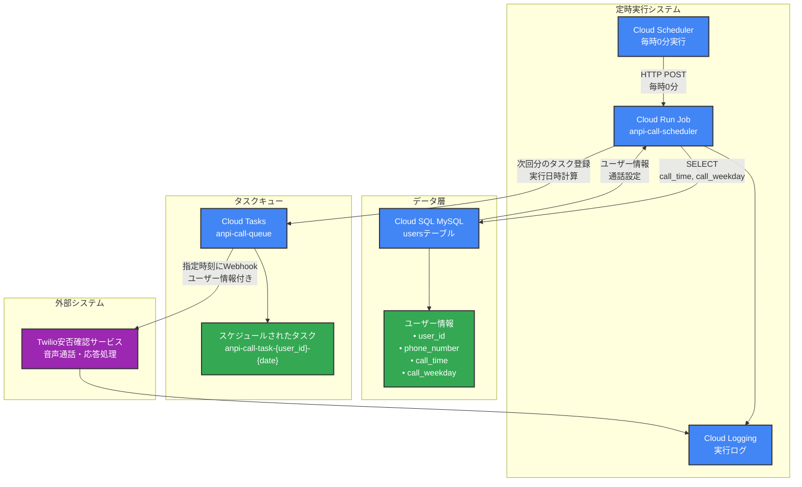
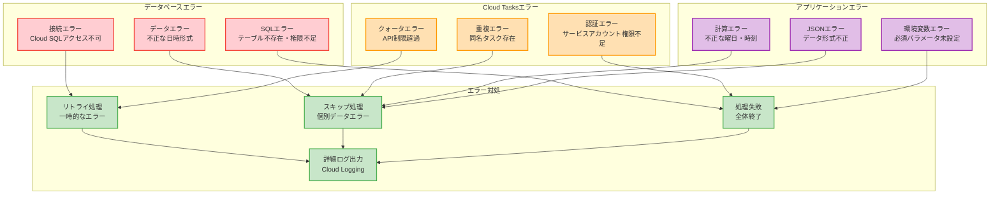

# 安否確認スケジューラー - 処理フロー詳細

本ドキュメントでは、安否確認呼び出しスケジューラーの詳細な処理フローをMermaid図で説明します。

## システム概要

安否確認スケジューラーは以下の仕様で動作します：

- **Cloud Run Job** で予定登録処理を実行
- **Cloud Scheduler** で定時実行（毎時0分）
- **Cloud Tasks** にタスクを登録
- **usersテーブル** から架電スケジュールを取得・計算

## 全体システム構成



## 詳細処理フロー

### 1. Cloud Run Job メイン処理

```mermaid
flowchart TD
    START([main.py 実行開始])
    
    subgraph "初期化処理"
        SETUP_LOG[ログ設定初期化<br/>setup_logging()]
        GET_ENV[環境変数取得<br/>PROJECT_ID, JOB_NAME等]
        LOG_INFO[実行情報ログ出力]
    end
    
    subgraph "安否確認スケジュール処理"
        PROCESS_START[process_safety_check_schedules()]
        GET_SCHEDULES[get_user_schedules()]
        CREATE_TASKS[Cloud Tasksタスク作成]
    end
    
    subgraph "追加処理"
        BATCH_SIM[バッチ処理シミュレーション<br/>3回ループ処理]
    end
    
    SUCCESS[処理完了ログ出力]
    END([exit_code=0])
    ERROR[例外処理]
    FAIL([exit_code=1])
    
    START --> SETUP_LOG
    SETUP_LOG --> GET_ENV
    GET_ENV --> LOG_INFO
    LOG_INFO --> PROCESS_START
    PROCESS_START --> GET_SCHEDULES
    GET_SCHEDULES --> CREATE_TASKS
    CREATE_TASKS --> BATCH_SIM
    BATCH_SIM --> SUCCESS
    SUCCESS --> END
    
    %% エラーハンドリング
    SETUP_LOG -.->|例外| ERROR
    GET_ENV -.->|例外| ERROR
    PROCESS_START -.->|例外| ERROR
    GET_SCHEDULES -.->|例外| ERROR
    CREATE_TASKS -.->|例外| ERROR
    ERROR --> FAIL
    
    %% スタイリング
    classDef init fill:#e8f5e8,stroke:#4caf50,stroke-width:2px
    classDef main fill:#e3f2fd,stroke:#2196f3,stroke-width:2px
    classDef additional fill:#fff3e0,stroke:#ff9800,stroke-width:2px
    classDef endpoint fill:#f3e5f5,stroke:#9c27b0,stroke-width:2px
    classDef error fill:#ffebee,stroke:#f44336,stroke-width:2px
    
    class SETUP_LOG,GET_ENV,LOG_INFO init
    class PROCESS_START,GET_SCHEDULES,CREATE_TASKS main
    class BATCH_SIM additional
    class START,SUCCESS,END endpoint
    class ERROR,FAIL error
```

### 2. データベース処理フロー

```mermaid
flowchart TD
    START[get_users_from_db()]
    
    subgraph "データベース接続"
        ENV_CHECK[実行環境判定<br/>Cloud Run判定]
        CLOUD_CONN[Cloud SQL接続<br/>Unix Socket]
        LOCAL_CONN[TCP接続<br/>開発環境用]
    end
    
    subgraph "データ取得"
        SQL_QUERY[SQLクエリ実行<br/>usersテーブル照会]
        FILTER[フィルタ条件<br/>call_time IS NOT NULL<br/>call_weekday IS NOT NULL]
        FETCH[結果セット取得<br/>dictionary形式]
    end
    
    DEBUG_LOG[取得データをデバッグログ出力]
    RETURN[ユーザー情報リスト返却]
    ERROR[データベースエラー<br/>ログ出力・例外送出]
    CLEANUP[接続クリーンアップ]
    
    START --> ENV_CHECK
    ENV_CHECK -->|Cloud Run環境| CLOUD_CONN
    ENV_CHECK -->|ローカル環境| LOCAL_CONN
    CLOUD_CONN --> SQL_QUERY
    LOCAL_CONN --> SQL_QUERY
    SQL_QUERY --> FILTER
    FILTER --> FETCH
    FETCH --> DEBUG_LOG
    DEBUG_LOG --> RETURN
    RETURN --> CLEANUP
    
    %% エラーハンドリング
    CLOUD_CONN -.->|接続エラー| ERROR
    LOCAL_CONN -.->|接続エラー| ERROR
    SQL_QUERY -.->|SQLエラー| ERROR
    FETCH -.->|取得エラー| ERROR
    ERROR --> CLEANUP
    
    %% スタイリング
    classDef connection fill:#4CAF50,stroke:#333,stroke-width:2px,color:#fff
    classDef query fill:#2196F3,stroke:#333,stroke-width:2px,color:#fff
    classDef process fill:#FF9800,stroke:#333,stroke-width:2px,color:#fff
    classDef error fill:#F44336,stroke:#333,stroke-width:2px,color:#fff
    
    class ENV_CHECK,CLOUD_CONN,LOCAL_CONN connection
    class SQL_QUERY,FILTER,FETCH query
    class DEBUG_LOG,RETURN,CLEANUP process
    class ERROR error
```

### 3. スケジュール計算処理

```mermaid
flowchart TD
    START[calculate_next_call_datetime()]
    
    subgraph "入力データ"
        INPUT_WEEKDAY[call_weekday<br/>例: 'mon', 'tue', 'wed']
        INPUT_TIME[call_time<br/>timedelta または time]
    end
    
    subgraph "曜日マッピング"
        WEEKDAY_MAP[曜日変換<br/>sun:6, mon:0, tue:1,<br/>wed:2, thu:3, fri:4, sat:5]
    end
    
    subgraph "時刻変換"
        TIME_CHECK[call_time型チェック]
        TIMEDELTA_CONV[timedelta → time変換<br/>時分秒計算]
    end
    
    subgraph "日付計算"
        CURRENT[現在日時取得]
        CURRENT_WEEKDAY[現在の曜日取得]
        DAYS_CALC[次回実行日までの日数計算<br/>(target_weekday - current_weekday) % 7]
    end
    
    subgraph "当日判定"
        TODAY_CHECK[当日かつ時刻未到来チェック]
        TODAY_EXEC[本日実行]
        NEXT_WEEK[来週実行<br/>+7日]
    end
    
    COMBINE[日付と時刻を結合]
    RETURN[次回実行日時を返却]
    ERROR[計算エラー]
    
    START --> INPUT_WEEKDAY
    START --> INPUT_TIME
    INPUT_WEEKDAY --> WEEKDAY_MAP
    INPUT_TIME --> TIME_CHECK
    TIME_CHECK -->|timedelta| TIMEDELTA_CONV
    TIME_CHECK -->|time| CURRENT
    TIMEDELTA_CONV --> CURRENT
    
    CURRENT --> CURRENT_WEEKDAY
    CURRENT_WEEKDAY --> DAYS_CALC
    DAYS_CALC --> TODAY_CHECK
    TODAY_CHECK -->|当日・時刻前| TODAY_EXEC
    TODAY_CHECK -->|当日・時刻後| NEXT_WEEK
    TODAY_CHECK -->|他の日| COMBINE
    TODAY_EXEC --> RETURN
    NEXT_WEEK --> COMBINE
    COMBINE --> RETURN
    
    %% エラーハンドリング
    WEEKDAY_MAP -.->|無効な曜日| ERROR
    TIMEDELTA_CONV -.->|変換エラー| ERROR
    DAYS_CALC -.->|計算エラー| ERROR
    
    %% スタイリング
    classDef input fill:#E8F5E8,stroke:#4CAF50,stroke-width:2px
    classDef mapping fill:#E3F2FD,stroke:#2196F3,stroke-width:2px
    classDef calculation fill:#FFF3E0,stroke:#FF9800,stroke-width:2px
    classDef decision fill:#F3E5F5,stroke:#9C27B0,stroke-width:2px
    classDef result fill:#FFEBEE,stroke:#F44336,stroke-width:2px
    
    class INPUT_WEEKDAY,INPUT_TIME input
    class WEEKDAY_MAP,TIME_CHECK,TIMEDELTA_CONV mapping
    class CURRENT,CURRENT_WEEKDAY,DAYS_CALC calculation
    class TODAY_CHECK,TODAY_EXEC,NEXT_WEEK decision
    class COMBINE,RETURN result
    class ERROR result
```

### 4. Cloud Tasks タスク作成処理

```mermaid
flowchart TD
    START[create_cloud_task()]
    
    subgraph "入力パラメータ"
        PROJECT[project_id]
        LOCATION[location]
        QUEUE[queue_name]
        SCHEDULE[schedule_time]
        URL[target_url]
        NAME[task_name]
    end
    
    CLIENT_INIT[Cloud Tasksクライアント初期化]
    TASK_CHECK[既存タスクチェック<br/>check_task_exists()]
    
    subgraph "タスク設定"
        PARENT[キューパス作成]
        HTTP_REQ[HTTP Request設定<br/>POST, JSON, Headers]
        BODY[リクエストボディ作成<br/>message, timestamp, user_info]
        TIMESTAMP[実行時刻設定<br/>Unix timestamp]
        TASK_NAME[タスク名設定]
    end
    
    CREATE[タスク作成API呼び出し]
    SUCCESS[作成成功ログ]
    SKIP[重複タスクスキップ]
    DUPLICATE[409エラー処理<br/>重複タスク]
    ERROR[その他エラー]
    RETURN[レスポンス返却]
    
    START --> PROJECT
    START --> LOCATION  
    START --> QUEUE
    START --> SCHEDULE
    START --> URL
    START --> NAME
    
    PROJECT --> CLIENT_INIT
    LOCATION --> CLIENT_INIT
    QUEUE --> CLIENT_INIT
    SCHEDULE --> CLIENT_INIT
    URL --> CLIENT_INIT
    NAME --> CLIENT_INIT
    
    CLIENT_INIT --> TASK_CHECK
    TASK_CHECK -->|存在する| SKIP
    TASK_CHECK -->|存在しない| PARENT
    
    PARENT --> HTTP_REQ
    HTTP_REQ --> BODY
    BODY --> TIMESTAMP
    TIMESTAMP --> TASK_NAME
    TASK_NAME --> CREATE
    
    CREATE -->|成功| SUCCESS
    CREATE -->|409重複| DUPLICATE
    CREATE -->|その他エラー| ERROR
    
    SUCCESS --> RETURN
    SKIP --> RETURN
    DUPLICATE --> RETURN
    ERROR --> RETURN
    
    %% スタイリング
    classDef input fill:#E8F5E8,stroke:#4CAF50,stroke-width:2px
    classDef process fill:#E3F2FD,stroke:#2196F3,stroke-width:2px
    classDef config fill:#FFF3E0,stroke:#FF9800,stroke-width:2px
    classDef api fill:#F3E5F5,stroke:#9C27B0,stroke-width:2px
    classDef result fill:#FFEBEE,stroke:#F44336,stroke-width:2px
    
    class PROJECT,LOCATION,QUEUE,SCHEDULE,URL,NAME input
    class CLIENT_INIT,TASK_CHECK process
    class PARENT,HTTP_REQ,BODY,TIMESTAMP,TASK_NAME config
    class CREATE api
    class SUCCESS,SKIP,DUPLICATE,ERROR,RETURN result
```

## 実行例：具体的なデータフロー

### サンプルユーザーデータ

```sql
-- usersテーブルのサンプルデータ
SELECT user_id, last_name, first_name, phone_number, call_weekday, call_time 
FROM users 
WHERE call_time IS NOT NULL AND call_weekday IS NOT NULL;

-- 結果例
-- user_id: 12345678-1234-1234-1234-123456789012
-- name: 山田 太郎
-- phone: +81-90-1234-5678
-- weekday: mon
-- time: 09:00:00
```

### 実行日時計算例

```mermaid
timeline
    title スケジュール計算例（2025年6月14日 土曜日 8:00実行）
    
    section 現在時刻
        2025-06-14 土 08:00 : Cloud Run Job実行
    
    section ユーザーA（月曜日 09:00）
        計算結果 : 2日後
        実行予定 : 2025-06-16 月 09:00
        タスク名 : anpi-call-task-12345678-20250616-0900
    
    section ユーザーB（水曜日 14:30）
        計算結果 : 4日後
        実行予定 : 2025-06-18 水 14:30
        タスク名 : anpi-call-task-87654321-20250618-1430
    
    section ユーザーC（金曜日 11:15）
        計算結果 : 6日後
        実行予定 : 2025-06-20 金 11:15
        タスク名 : anpi-call-task-11223344-20250620-1115
```

## エラーハンドリング

### 主要なエラーケースと対処法



## 参考資料

本処理フローの詳細実装は以下のファイルを参照してください：

- [`main.py`](../main.py) - メイン処理ロジック
- [`job.yaml`](../job.yaml) - Cloud Run Job設定
- [`requirements.txt`](../requirements.txt) - 依存ライブラリ
- [システム構成図](system-architecture.md) - 全体アーキテクチャ
- [セットアップガイド](setup-guide.md) - 環境構築手順
