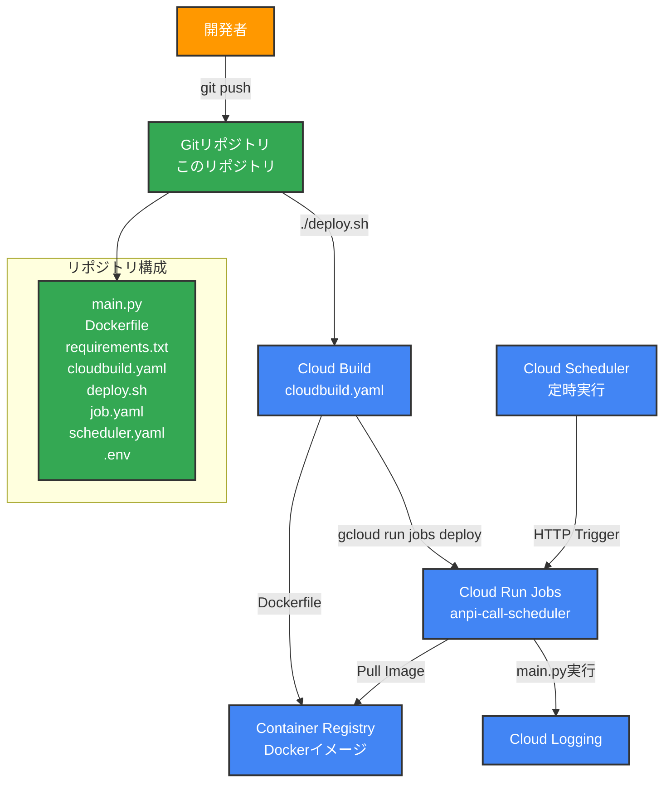
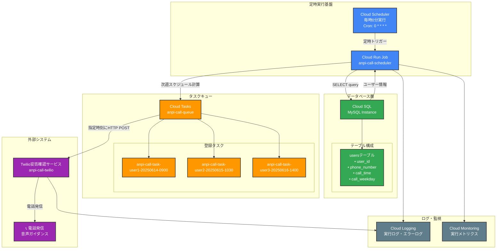
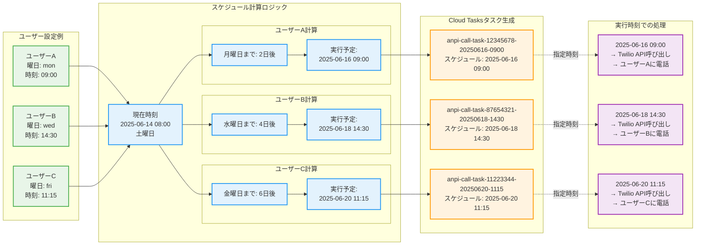

# システム構造図

本ドキュメントでは、安否確認呼び出しスケジューラー（バッチ処理システム）の構造をMermaid図で記載します。

## バッチ処理システム構成



## バッチ処理実行フロー

```mermaid
flowchart TD
    START([処理開始])
    INIT[ログ設定初期化<br/>setup_logging()]
    ENV[環境変数取得<br/>PROJECT_ID, JOB_NAME等]
    LOG_INFO[実行情報ログ出力<br/>プロジェクトID, 環境等]
    BATCH[バッチ処理シミュレーション<br/>5ステップの繰り返し処理]
    SUCCESS[成功ログ出力]
    END([処理終了<br/>exit_code=0])
    ERROR[例外処理<br/>エラーログ出力]
    FAIL([処理失敗<br/>exit_code=1])
    
    START --> INIT
    INIT --> ENV
    ENV --> LOG_INFO
    LOG_INFO --> BATCH
    BATCH --> SUCCESS
    SUCCESS --> END
    
    %% エラーハンドリング
    INIT -.->|例外| ERROR
    ENV -.->|例外| ERROR
    LOG_INFO -.->|例外| ERROR
    BATCH -.->|例外| ERROR
    ERROR --> FAIL
    
    %% スタイリング
    classDef process fill:#e3f2fd,stroke:#1976d2,stroke-width:2px
    classDef endpoint fill:#f3e5f5,stroke:#7b1fa2,stroke-width:2px
    classDef error fill:#ffebee,stroke:#d32f2f,stroke-width:2px
    
    class INIT,ENV,LOG_INFO,BATCH,SUCCESS process
    class START,END endpoint
    class ERROR,FAIL error
```

## 安否確認スケジューラー詳細処理フロー

```mermaid
flowchart TD
    START([Cloud Run Job開始])
    INIT[環境設定・ログ初期化]
    
    subgraph "データベース処理"
        DB_CONN[Cloud SQL接続<br/>Unix Socket/TCP]
        DB_QUERY[usersテーブル照会<br/>call_time, call_weekday]
        DB_FETCH[ユーザー情報取得<br/>phone_number, user_id]
    end
    
    subgraph "スケジュール計算"
        CALC_START[各ユーザー処理開始]
        WEEKDAY_MAP[曜日マッピング<br/>mon:0, tue:1, ...sun:6]
        NEXT_DATETIME[次回実行日時計算<br/>現在時刻+曜日オフセット]
        TASK_NAME[タスク名生成<br/>anpi-call-task-{ID}-{DATE}]
    end
    
    subgraph "Cloud Tasks登録"
        TASK_CHECK[既存タスク重複チェック]
        CREATE_TASK[新規タスク作成]
        TASK_CONFIG[タスク設定<br/>HTTP POST, Target URL]
        SCHEDULE_TIME[実行時刻設定<br/>Unix Timestamp]
    end
    
    subgraph "外部システム連携"
        TARGET_URL[安否確認システム<br/>Twilioサービス]
        WEBHOOK[Webhook呼び出し<br/>ユーザー情報付き]
    end
    
    RESULT[処理結果ログ出力<br/>新規作成/スキップ件数]
    END([処理完了])
    ERROR[エラーハンドリング]
    
    START --> INIT
    INIT --> DB_CONN
    DB_CONN --> DB_QUERY
    DB_QUERY --> DB_FETCH
    DB_FETCH --> CALC_START
    
    CALC_START --> WEEKDAY_MAP
    WEEKDAY_MAP --> NEXT_DATETIME
    NEXT_DATETIME --> TASK_NAME
    TASK_NAME --> TASK_CHECK
    
    TASK_CHECK -->|新規| CREATE_TASK
    TASK_CHECK -->|重複| RESULT
    CREATE_TASK --> TASK_CONFIG
    TASK_CONFIG --> SCHEDULE_TIME
    SCHEDULE_TIME --> TARGET_URL
    TARGET_URL --> WEBHOOK
    WEBHOOK --> RESULT
    
    RESULT --> END
    
    %% エラーハンドリング
    DB_CONN -.->|接続エラー| ERROR
    DB_QUERY -.->|SQLエラー| ERROR  
    CREATE_TASK -.->|APIエラー| ERROR
    ERROR --> END
    
    %% スタイリング
    classDef database fill:#4CAF50,stroke:#333,stroke-width:2px,color:#fff
    classDef calculation fill:#2196F3,stroke:#333,stroke-width:2px,color:#fff
    classDef tasks fill:#FF9800,stroke:#333,stroke-width:2px,color:#fff
    classDef external fill:#9C27B0,stroke:#333,stroke-width:2px,color:#fff
    classDef process fill:#607D8B,stroke:#333,stroke-width:2px,color:#fff
    classDef endpoint fill:#F44336,stroke:#333,stroke-width:2px,color:#fff
    
    class DB_CONN,DB_QUERY,DB_FETCH database
    class CALC_START,WEEKDAY_MAP,NEXT_DATETIME,TASK_NAME calculation
    class TASK_CHECK,CREATE_TASK,TASK_CONFIG,SCHEDULE_TIME tasks
    class TARGET_URL,WEBHOOK external
    class INIT,RESULT process
    class START,END,ERROR endpoint
```

## データフロー構成図



## タスクスケジューリング処理詳細



## コマンド実行例

### デプロイメント
```bash
# 開発環境デプロイ
./deploy.sh

# 本番環境用設定でデプロイ（.envを本番設定に変更後）
ENVIRONMENT=production ./deploy.sh
```

### 手動実行
```bash
# 開発環境ジョブの手動実行
gcloud run jobs execute anpi-call-scheduler-dev --region=asia-northeast1

# ログ確認
gcloud logging read "resource.type=cloud_run_job AND resource.labels.job_name=anpi-call-scheduler-dev" --limit=20
```

### 実行履歴確認
```bash
# 実行履歴表示
gcloud run jobs executions list --job=anpi-call-scheduler-dev --region=asia-northeast1 --limit=5
```

## 参考

- [setup-guide.md](setup-guide.md) - セットアップ手順
- [deployment.md](deployment.md) - デプロイメント詳細手順
- [gcp-resources.md](gcp-resources.md) - GCPリソースの詳細仕様
- [troubleshooting.md](troubleshooting.md) - トラブルシューティング
