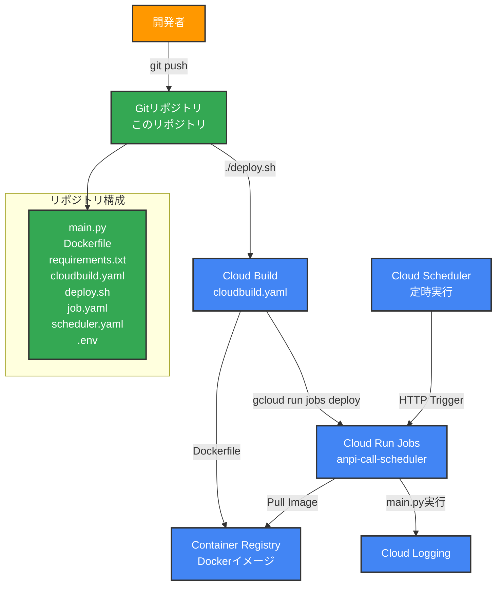
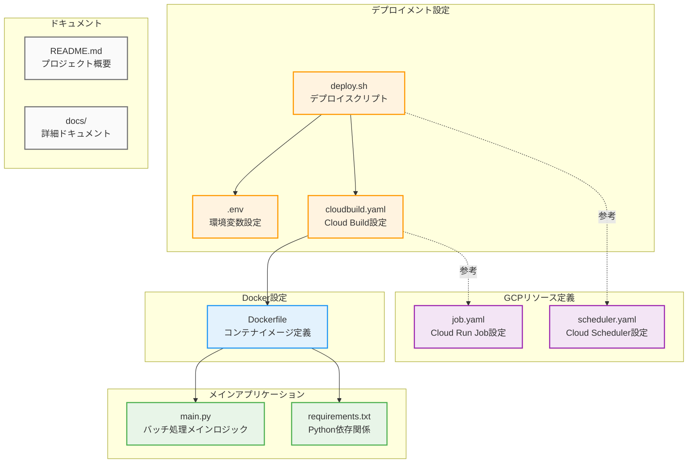
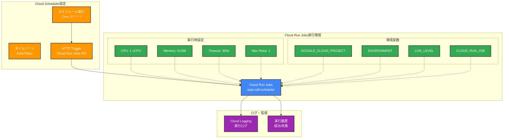
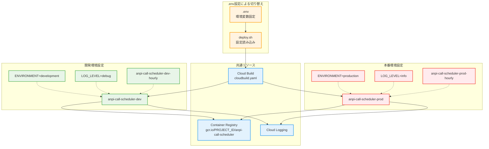

# システム構造図

本ドキュメントでは、安否確認呼び出しスケジューラー（バッチ処理システム）の構造をMermaid図で記載します。

## バッチ処理システム構成



## バッチ処理実行フロー

```mermaid
flowchart TD
    START([処理開始])
    INIT[ログ設定初期化<br/>setup_logging()]
    ENV[環境変数取得<br/>PROJECT_ID, JOB_NAME等]
    LOG_INFO[実行情報ログ出力<br/>プロジェクトID, 環境等]
    BATCH[バッチ処理シミュレーション<br/>5ステップの繰り返し処理]
    SUCCESS[成功ログ出力]
    END([処理終了<br/>exit_code=0])
    ERROR[例外処理<br/>エラーログ出力]
    FAIL([処理失敗<br/>exit_code=1])
    
    START --> INIT
    INIT --> ENV
    ENV --> LOG_INFO
    LOG_INFO --> BATCH
    BATCH --> SUCCESS
    SUCCESS --> END
    
    %% エラーハンドリング
    INIT -.->|例外| ERROR
    ENV -.->|例外| ERROR
    LOG_INFO -.->|例外| ERROR
    BATCH -.->|例外| ERROR
    ERROR --> FAIL
    
    %% スタイリング
    classDef process fill:#e3f2fd,stroke:#1976d2,stroke-width:2px
    classDef endpoint fill:#f3e5f5,stroke:#7b1fa2,stroke-width:2px
    classDef error fill:#ffebee,stroke:#d32f2f,stroke-width:2px
    
    class INIT,ENV,LOG_INFO,BATCH,SUCCESS process
    class START,END endpoint
    class ERROR,FAIL error
```

## デプロイメント実行フロー

```mermaid
flowchart LR
    subgraph "開発環境"
        DEV[開発者]
        ENV_FILE[.env設定ファイル]
        DEPLOY[deploy.sh実行]
    end
    
    subgraph "Cloud Build処理"
        CONFIG[cloudbuild.yaml読み込み]
        BUILD[Dockerビルド<br/>Dockerfile]
        PUSH[イメージプッシュ<br/>Container Registry]
        JOBS[Cloud Run Jobs<br/>デプロイ]
    end
    
    subgraph "スケジューラー設定"
        SCHED[Cloud Scheduler<br/>作成・更新]
        CRON[Cron設定<br/>定時実行]
    end
    
    DEV --> ENV_FILE
    ENV_FILE --> DEPLOY
    DEPLOY --> CONFIG
    CONFIG --> BUILD
    BUILD --> PUSH
    PUSH --> JOBS
    JOBS --> SCHED
    SCHED --> CRON
    
    classDef dev fill:#ff9800,stroke:#333,stroke-width:2px,color:#fff
    classDef build fill:#4285f4,stroke:#333,stroke-width:2px,color:#fff
    classDef schedule fill:#34a853,stroke:#333,stroke-width:2px,color:#fff
    
    class DEV,ENV_FILE,DEPLOY dev
    class CONFIG,BUILD,PUSH,JOBS build
    class SCHED,CRON schedule
```



## ファイル構成と役割



## 実行環境構成



## 環境別構成



## コマンド実行例

### デプロイメント
```bash
# 開発環境デプロイ
./deploy.sh

# 本番環境用設定でデプロイ（.envを本番設定に変更後）
ENVIRONMENT=production ./deploy.sh
```

### 手動実行
```bash
# 開発環境ジョブの手動実行
gcloud run jobs execute anpi-call-scheduler-dev --region=asia-northeast1

# ログ確認
gcloud logging read "resource.type=cloud_run_job AND resource.labels.job_name=anpi-call-scheduler-dev" --limit=20
```

### 実行履歴確認
```bash
# 実行履歴表示
gcloud run jobs executions list --job=anpi-call-scheduler-dev --region=asia-northeast1 --limit=5
```

## 参考

- [setup-guide.md](setup-guide.md) - セットアップ手順
- [deployment.md](deployment.md) - デプロイメント詳細手順
- [gcp-resources.md](gcp-resources.md) - GCPリソースの詳細仕様
- [troubleshooting.md](troubleshooting.md) - トラブルシューティング
